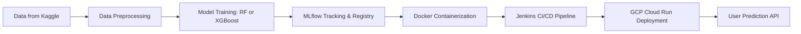

# 🏨 Hotel Reservation Prediction using MLflow, Jenkins & GCP

[](https://www.python.org/)
[](https://mlflow.org/)
[](https://www.jenkins.io/)
[](https://cloud.google.com/run)
[](LICENSE)

🔗 **Live Demo:** [hotel-reservation-prediction-459049856235.us-central1.run.app](https://hotel-reservation-prediction-459049856235.us-central1.run.app)  
💻 **GitHub Repo:** [Pratikshk16/Hotel-Reservation-Prediction-with-MLFlow-Jenkins-and-GCP-Deployment](https://github.com/Pratikshk16/Hotel-Reservation-Prediction-with-MLFlow-Jenkins-and-GCP-Deployment)  
📊 **Dataset:** [Hotel Reservations Classification Dataset (Kaggle)](https://www.kaggle.com/datasets/ahsan81/hotel-reservations-classification-dataset)

---

## 📚 Table of Contents
- [🧩 Project Overview](#-project-overview)
- [🎯 Objective](#-objective)
- [📂 Dataset](#-dataset)
- [🧠 Solution Pipeline](#-solution-pipeline)
- [🏗️ Tech Stack](#-tech-stack)
- [⚙️ Setup Instructions](#️-setup-instructions)
- [📊 MLflow Tracking](#-mlflow-tracking)
- [⚙️ CI/CD with Jenkins](#️-cicd-with-jenkins)
- [☁️ Deployment on GCP](#️-deployment-on-gcp)
- [📈 Results](#-results)
- [🧾 License](#-license)
- [🤝 Contributing](#-contributing)
- [📬 Contact](#-contact)

---

## 🧩 Project Overview

This project predicts **whether a hotel reservation will be canceled or not** using machine learning.  
It demonstrates a full **MLOps pipeline** — from data preprocessing and model tracking with **MLflow**,  
to **automated CI/CD using Jenkins**, and **deployment on Google Cloud Run (GCP)** 🌩️

---

## 🎯 Objective

Hotel booking cancellations cause major revenue losses.  
By predicting potential cancellations early, hotels can:
- Adjust pricing strategies  
- Optimize occupancy rates  
- Improve customer satisfaction  

This project aims to **automate** that prediction workflow end-to-end.

---

## 📂 Dataset

🗂️ **Source:** [Kaggle - Hotel Reservations Classification Dataset](https://www.kaggle.com/datasets/ahsan81/hotel-reservations-classification-dataset)  
📈 **Records:** ~36,000 bookings  
🎯 **Target Column:** `booking_status` → (`Canceled` / `Not_Canceled`)

**Example Features:**
- `no_of_adults`
- `no_of_children`
- `lead_time`
- `avg_price_per_room`
- `type_of_meal_plan`
- `required_car_parking_space`
- `market_segment_type`

---

## 🧠 Solution Pipeline

1. **Data Preprocessing** – Cleaning, encoding categorical variables, handling nulls  
2. **Model Training** – Using classifiers (Random Forest / XGBoost)  
3. **Experiment Tracking** – Log runs & metrics using **MLflow**  
4. **Model Packaging** – Save and version best model  
5. **API Creation** – Serve model with Flask/FastAPI  
6. **Containerization** – Build Docker image  
7. **CI/CD Pipeline** – Automate training → testing → deploy using **Jenkins**  
8. **Cloud Deployment** – Deploy containerized app to **GCP Cloud Run**

---

## 🏗️ Tech Stack

| Category | Tools / Frameworks |
|-----------|--------------------|
| **Language** | Python 🐍 |
| **ML Tracking** | MLflow |
| **Web Framework** | Flask / FastAPI |
| **Automation (CI/CD)** | Jenkins |
| **Containerization** | Docker |
| **Cloud Deployment** | Google Cloud Run |
| **Data Source** | Kaggle Dataset |
| **Version Control** | Git & GitHub |

---

## ⚙️ Setup Instructions

### 🧾 Prerequisites
Ensure you have the following installed:
- Python 3.8+
- Docker
- Git
- (Optional) GCP CLI & credentials
- Jenkins (if setting up CI/CD locally)

### 🪜 Installation Steps
```bash
# 1️⃣ Clone this repository
git clone https://github.com/Pratikshk16/Hotel-Reservation-Prediction-with-MLFlow-Jenkins-and-GCP-Deployment.git
cd Hotel-Reservation-Prediction-with-MLFlow-Jenkins-and-GCP-Deployment

# 2️⃣ Create & activate virtual environment
python -m venv venv
source venv/bin/activate   # macOS/Linux
# venv\Scripts\activate    # Windows

# 3️⃣ Install dependencies
pip install -r requirements.txt

# 4️⃣ Run the application locally
python app.py
````

---

## 📊 MLflow Tracking

All experiments are tracked using **MLflow**, including:

* Parameters (e.g., n_estimators, max_depth)
* Metrics (accuracy, precision, recall)
* Artifacts (models, plots)
* Model versions (in MLflow Model Registry)

Start MLflow UI:

```bash
mlflow ui
```

Then open [http://localhost:5000](http://localhost:5000)

📸 Example Tracking Screenshot:
*(You can add an MLflow screenshot here)*

---

## ⚙️ CI/CD with Jenkins

1. **Jenkins Pipeline** automates:

   * Model training
   * Unit testing
   * Docker image building
   * Deployment to Cloud Run

2. Example Jenkinsfile stages:

```groovy
pipeline {
    agent any
    stages {
        stage('Clone Repo') {
            steps { git 'https://github.com/Pratikshk16/Hotel-Reservation-Prediction-with-MLFlow-Jenkins-and-GCP-Deployment.git' }
        }
        stage('Install Dependencies') {
            steps { sh 'pip install -r requirements.txt' }
        }
        stage('Run Tests') {
            steps { sh 'pytest' }
        }
        stage('Build Docker Image') {
            steps { sh 'docker build -t hotel-prediction .' }
        }
        stage('Deploy to GCP') {
            steps {
                sh '''
                gcloud run deploy hotel-prediction \
                    --image gcr.io/$PROJECT_ID/hotel-prediction \
                    --platform managed --region us-central1
                '''
            }
        }
    }
}
```

---

## ☁️ Deployment on GCP

**Service:** Google Cloud Run
**Container Registry:** Google Container Registry (GCR)

Deployment Steps:

```bash
# Build Docker image
docker build -t gcr.io/<PROJECT_ID>/hotel-prediction .

# Push to GCR
docker push gcr.io/<PROJECT_ID>/hotel-prediction

# Deploy to Cloud Run
gcloud run deploy hotel-prediction \
  --image gcr.io/<PROJECT_ID>/hotel-prediction \
  --platform managed --region us-central1
```

🌐 Access your app at:
`https://hotel-reservation-prediction-459049856235.us-central1.run.app`

---

## 📈 Results

| Model         | Accuracy | Precision | Recall   | F1 Score |
| ------------- | -------- | --------- | -------- | -------- |
| Random Forest | 0.91     | 0.90      | 0.89     | 0.89     |
| XGBoost       | **0.93** | **0.92**  | **0.91** | **0.91** |

✅ **Best model:** XGBoost
🧠 Logged & versioned in **MLflow**

---

## 🧾 License

This project is licensed under the [MIT License](LICENSE).

---

## 🤝 Contributing

Contributions are welcome!
To contribute:

1. Fork this repo
2. Create a new branch (`feature/your-feature`)
3. Commit your changes
4. Submit a pull request 🎉

---

## 📬 Contact

👤 **Author:** [Pratik Suchak](https://github.com/Pratikshk16)
📧 **Email:** [pratiksuchak16@gmail.com](mailto:pratiksuchak16@gmail.com)
🌍 **LinkedIn:** [linkedin.com/in/pratikshak16](https://linkedin.com/in/pratikshak16)

---
## 🚀 End-to-End Machine Learning Deployment Pipeline

